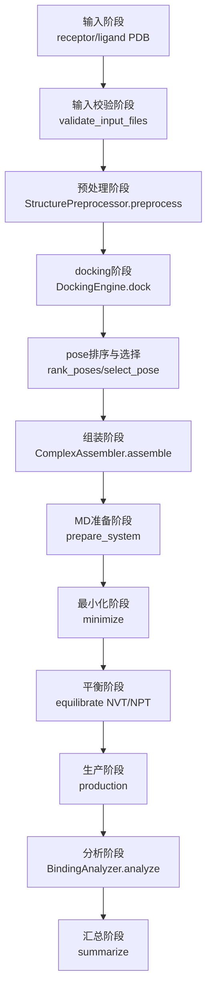

# VEVs: Route A Current Status (Updated 2026-03-13)

本仓库当前目标是按 `casetwo.md` 的分层架构推进 `integrin-mediated targeting recognition`，先把 Route A（solution mode）做成可运行、可追踪、可回归的最小闭环。

## 1. 今日完成进度（基于 `deepresearch3_10.md` + 实际代码）

### 1.1 已打通主链（minimum runnable Route A）
- `validate -> preprocess -> dock -> assemble -> AA-MD -> analyze -> summarize`
- 主入口：`scripts/run_binding_route_a.py`
- OpenMM 单链路验证入口：`scripts/run_minimal_openmm_validation.py`

### 1.2 Docking 层（placeholder，可重复，可追踪）
- 目录：`src/models/docking/`
- 已有模块：
  - `placeholder_engine.py`
  - `scoring.py`
  - `pdb_utils.py`
  - `result_validation.py`
- 说明：当前分数是 `proxy_*`，用于工程链路验证，不代表发表级物理结论。

### 1.3 全原子 MD 执行器增强（3.13融合郑 `aa_md.py` 的可用优点）
文件：`src/models/all_atom/simulation_runner.py`

3.13已融合两人代码并落地：
1. 力场映射修复（force-field XML mapping）
- `amber14sb`: `amber14-all.xml` + `amber14/<water>.xml`
- `charmm36`: `charmm36.xml` + `charmm36/<water>.xml`
- 不支持项会抛出带“支持列表”的 `ValueError`。

2. 平台属性兼容层（platform-specific properties）
- 运行时查询 `platform.getPropertyNames()`。
- 精度属性兼容：
  - `Precision`
  - `CudaPrecision`
  - `OpenCLPrecision`
- 可选设备/线程兼容：
  - `DeviceIndex` / `CudaDeviceIndex` / `OpenCLDeviceIndex`
  - `Threads` / `CpuThreads`
- 平台不可用时自动回退 CPU，默认 Route A CPU 行为不变。

3. 可控 PDBFixer 后处理（execution-layer post-fix）
- 新增执行层开关：`MDConfig.enable_pdbfixer_fix`（默认 `True`）。
- 新增替换开关：`SystemConfig.replace_nonstandard_residues`（默认 `False`，避免 silent mutation）。
- 产物与报告：
  - `work/runs/<run_id>/md/complex_fixed.pdb`
  - `outputs/runs/<run_id>/metadata/md_pdbfixer_report.json`

4. 新增 solvated 初态锚点
- `work/runs/<run_id>/md/solvated.pdb`
- 作用：调试/可视化锚点（debug visualization anchor）。

5. `createSystem` 低风险增强
- `rigidWater=True`
- `ewaldErrorTolerance=0.0005`

6. 搭档脚本归并完成
- `scripts/aa_md.py` 的可用增强点已并入执行器，原文件已删除，避免双实现分叉。

### 1.4 结构准备/分析/工作流
- `src/utils/structure_repository.py`
- `src/utils/structure_preprocessor.py`
- `src/utils/complex_assembler.py`
- `src/analysis/binding_analyzer.py`
- `src/models/workflows/binding_workflow.py`

均已与 `src/models/docking/` 和 `AllAtomSimulation` 联通，支持 run_id 分目录输出。

## 2. 当前分层架构（必须保持）

- `src/configs`: 配置 dataclass 与校验
- `src/interfaces/contracts.py`: I/O 契约与 Protocol
- `src/models/workflows`: 编排层（orchestration）
- `src/models/all_atom`: OpenMM 执行层（execution）
- `src/models/docking`: docking 子系统
- `src/utils`: 输入校验/预处理/组装
- `src/analysis`: 轨迹与指标分析
- `scripts`: 入口脚本
- `tests`: smoke 与回归测试

## 3. 运行方式（WSL2 + conda `vesicle_sim`）

建议环境：
- Python: `3.10`
- 依赖：`openmm`, `pdbfixer`, `MDAnalysis`, `numpy`, `pandas`, `matplotlib`, `pytest`

### 3.1 先跑关键回归
```bash
python -m pytest -q -rs \
  tests/test_route_a_workflow_smoke.py \
  tests/test_run_manifest_smoke.py \
  tests/test_binding_analyzer_smoke.py
```

### 3.2 运行 OpenMM 最小闭环验证（建议带 run_id）
```bash
python scripts/run_minimal_openmm_validation.py \
  --run-id openmm_validation_YYYYmmdd_HHMMSS
```

### 3.3 运行 Route A 主入口  routeA_YYYYmmdd_HHMMSS需要自行替换
```bash
python scripts/run_binding_route_a.py \
  --run-id routeA_YYYYmmdd_HHMMSS \
  --receptor data/test_systems/minimal_complex/minimal_complex.pdb \
  --ligand data/test_systems/minimal_complex/minimal_complex.pdb
```

## 4. 输出目录规范（run_id mandatory）

本节按两个入口脚本分别说明：
1. 文件会写到哪个目录。
2. 每个文件在什么阶段生成。
3. 每个文件包含什么内容、有什么作用。

统一约束：
- 所有新运行都应写入 `work/runs/<run_id>/` 与 `outputs/runs/<run_id>/`。
- `work/` 存放过程产物（process artifacts），`outputs/` 存放结果产物（result artifacts）。

### 4.0 阶段到文件总映射图（Mermaid）



### 4.1 `run_binding_route_a.py` 成功运行后的输出

执行命令示例：
注意：routeA_YYYYmmdd_HHMMSS 要自行替换命名！minimal_complex.pdb可替换成任何.pdb文件
```bash
python scripts/run_binding_route_a.py \
  --run-id routeA_YYYYmmdd_HHMMSS \
  --receptor data/test_systems/minimal_complex/minimal_complex.pdb \
  --ligand data/test_systems/minimal_complex/minimal_complex.pdb
```

#### 4.1.1 `work/runs/<run_id>/`（过程产物）

##### A. `preprocessed/`（结构预处理阶段）

- `receptor_clean.pdb`
  - 生成阶段：`StructurePreprocessor.preprocess`。
  - 内容：清洗后的 receptor PDB（去杂质、补缺失原子等最小处理后结构）。
  - 作用：作为 docking 与组装的标准 receptor 输入。

- `ligand_prepared.pdb`
  - 生成阶段：`StructurePreprocessor.preprocess`。
  - 内容：清洗/标准化后的 ligand PDB。
  - 作用：作为 docking 的ligand输入，保证后续步骤使用统一格式结构。

##### B. `assembled/`（复合体组装阶段）

- `complex_initial.pdb`
  - 生成阶段：`ComplexAssembler.assemble`。
  - 内容：根据 selected pose 组装出的 receptor-ligand 初始复合体结构。
  - 作用：作为 AA-MD 的直接输入锚点（assembled complex anchor）。

##### C. `md/`（AA-MD 执行阶段）

- `complex_fixed.pdb`
  - 生成阶段：`AllAtomSimulation.prepare_system` 内 execution-layer PDBFixer post-fix。
  - 内容：在 execution 层做缺失原子修复后的复合体 PDB。
  - 作用：提高输入鲁棒性，避免 OpenMM 因拓扑问题直接失败。

- `solvated.pdb`
  - 生成阶段：`modeller.addSolvent` 后立即写出。
  - 内容：加氢、加水、加离子后的初态结构。
  - 作用：可视化/debug 锚点，快速检查溶剂化是否合理。

- `system.xml`
  - 生成阶段：`prepare_system` 完成 system 构建后。
  - 内容：OpenMM `System` 序列化结果（力场参数、约束、非键设置等）。
  - 作用：复现与审计系统构建参数。

- `state_init.xml`
  - 生成阶段：`prepare_system` 结束时。
  - 内容：初始上下文状态（坐标、盒子等）序列化。
  - 作用：作为初始状态快照用于重现。

- `minimized.pdb`
  - 生成阶段：`minimize` 后。
  - 内容：能量最小化后的结构坐标。
  - 作用：检查最小化是否稳定收敛。

- `equil_nvt_last.pdb`
  - 生成阶段：`equilibrate` 的 NVT 子阶段结束。
  - 内容：NVT 平衡最后一帧结构。
  - 作用：检查温控平衡后的结构状态。

- `equil_npt_last.pdb`
  - 生成阶段：`equilibrate` 的 NPT 子阶段结束。
  - 内容：NPT 平衡最后一帧结构。
  - 作用：作为 trajectory 参考拓扑输入之一。

- `production.dcd`
  - 生成阶段：`production`。
  - 内容：生产期轨迹（多帧坐标）。
  - 作用：后续 RMSD/接触/H-bond 等动力学分析的核心数据源。

- `md_log.csv`
  - 生成阶段：`production` reporter 周期写出。
  - 内容：step、time、能量、温度、体积、密度等时间序列。
  - 作用：数值稳定性诊断与快速故障排查。

- `production.chk`
  - 生成阶段：`production` reporter 与结束时 checkpoint。
  - 内容：OpenMM checkpoint 二进制快照。
  - 作用：断点续跑/故障恢复。

- `final_state.xml`
  - 生成阶段：`production` 结束时。
  - 内容：最终状态序列化。
  - 作用：记录 run 末态，便于复现与后处理。

#### 4.1.2 `outputs/runs/<run_id>/`（结果产物）

##### A. `docking/`（docking 阶段）

- `poses.csv`
  - 生成阶段：`DockingEngine.dock`。
  - 内容：每个 pose 的评分与元数据表（含 `proxy_*` 字段）。
  - 作用：pose 排序、筛选、可追踪记录。

- `poses/pose_*.pdb`
  - 生成阶段：`DockingEngine.dock`。
  - 内容：每个候选 pose 的复合体结构文件。
  - 作用：人工检查 docking 构象、回溯 selected pose。

##### B. `analysis/binding/`（分析阶段）

- `metrics.json`
  - 生成阶段：`BindingAnalyzer.analyze`。
  - 内容：结构化指标摘要（如 `n_frames`、RMSD 统计、`analysis_mode`、`metrics_semantics`）。
  - 作用：机器可读结果接口（后续脚本/报告直接消费）。

- `rmsd.csv`
  - 生成阶段：`BindingAnalyzer.analyze`（trajectory 模式）。
  - 内容：逐帧 RMSD 数据表。
  - 作用：用于进一步统计分析或绘图复用。

- `figures/rmsd.png`
  - 生成阶段：`BindingAnalyzer.analyze`。
  - 内容：RMSD 曲线图。
  - 作用：快速人工判断轨迹稳定性趋势。

##### C. `metadata/`（元数据与边界声明阶段）

- `preprocess_report.json`
  - 生成阶段：`StructurePreprocessor.preprocess`。
  - 内容：预处理动作、输入信息、清洗结果摘要。
  - 作用：输入可追踪性（input provenance）。

- `md_pdbfixer_report.json`
  - 生成阶段：`prepare_system` 中 execution-layer PDBFixer。
  - 内容：缺失残基/原子计数、nonstandard residue 列表、是否替换等。
  - 作用：避免 silent mutation，明确 execution 层修复行为。

- `run_manifest.json`
  - 生成阶段：`BindingWorkflow.summarize -> _write_run_manifest`。
  - 内容：`backend`、`analysis_mode`、`scientific_validity`。
  - 作用：本次 run 的边界契约文件，防止误读结果语义。

##### D. `reports/`（总结报告阶段）

- `route_a_summary.md`
  - 生成阶段：`BindingWorkflow.summarize -> _write_route_a_summary`。
  - 内容：中文详细流程总结、流程图、关键文件解释、归档建议。
  - 作用：给人阅读的 run 级交付报告。

##### E. `logs/`

- 当前通常为空（预留目录）。
- 作用：后续可放 workflow 级运行日志。

### 4.2 `run_minimal_openmm_validation.py` 成功运行后的输出

执行命令示例：
```bash
python scripts/run_minimal_openmm_validation.py \
  --run-id openmm_validation_YYYYmmdd_HHMMSS
```

该脚本只做 OpenMM 主链验证（不走 binding workflow），因此输出更少。

#### 4.2.1 `work/runs/<run_id>/md/`（AA-MD 验证阶段）

会生成与 Route A 的 MD 子集基本一致的文件：
- `complex_fixed.pdb`
- `solvated.pdb`
- `system.xml`
- `state_init.xml`
- `minimized.pdb`
- `equil_nvt_last.pdb`
- `equil_npt_last.pdb`
- `production.dcd`
- `md_log.csv`
- `production.chk`
- `final_state.xml`

这些文件的内容和作用与 4.1.1-C 相同，只是来源于“单脚本验证链”，不是完整 workflow。

#### 4.2.2 `outputs/runs/<run_id>/metadata/`（执行层元数据）

- `md_pdbfixer_report.json`
  - 生成阶段：`prepare_system` execution-layer PDBFixer。
  - 作用：记录输入修复行为，用于验证引擎鲁棒性。

`reports/` 和 `logs/` 在该脚本下通常为空或仅保留目录。

### 4.3 目录清理与归档建议

- `outputs/` 根目录建议只保留：`runs/`、`archive/`、`.gitkeep`。
- `work/` 根目录建议只保留：`runs/`、`archive/`、`.gitkeep`。
- 历史根级产物统一迁移到：`archive/legacy_*`。
- 每次需要交付时，以下内容建议归档：
  - `outputs/runs/<run_id>/docking/`
  - `outputs/runs/<run_id>/analysis/binding/`
  - `outputs/runs/<run_id>/metadata/`
  - `outputs/runs/<run_id>/reports/route_a_summary.md`
  - `work/runs/<run_id>/md/production.dcd`
  - `work/runs/<run_id>/md/md_log.csv`
## 5. 仍未完成的结构性缺口

1. 真实 docking backend（当前是 placeholder）
2. endpoint free energy 的真实计算链
3. membrane mode 的真实执行链（Route B）
4. umbrella sampling / PMF
5. 更严格的不确定性评估与科学验证流程

## 6. 后续建议计划（对齐 `casetwo.md`）

1. 固定 Route A 数据与参数基线，形成可重复 benchmark run。
2. 在不破坏当前契约前提下，引入首个真实 docking backend 适配层。
3. 强化分析层：补充接触图/H-bond 等基础指标与单元测试。
4. 启动 membrane-ready 协议分支设计文档（仅接口，不提前混入实现）。
