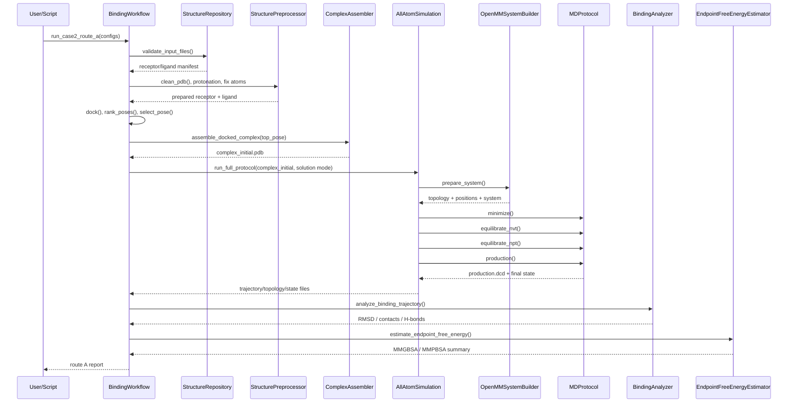
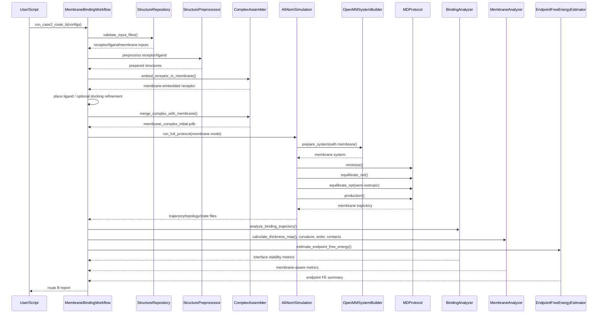
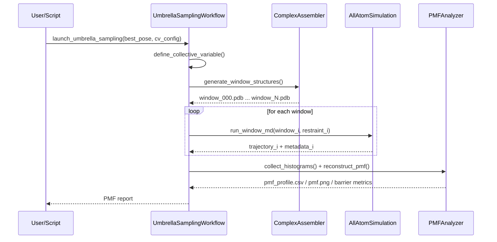

# 案例二软件架构重构与实施规划（Architecture Refactor Plan for Simulation Case 2）

## 0. 文档目的（Purpose）

本文档用于把当前案例二——**整合素介导的靶向识别（integrin-mediated targeting recognition）**——从“概念性代码骨架”重构为**方法层分离清楚（clear methodological separation）**、可逐步落地的工程架构。

本文档解决四个问题：

1. 当前 `aa_md.py`、`membrane_analysis.py`、`README.md` 中已有模块分别能做什么、不能做什么。
2. 基础路线A（无膜 binding workflow）与进阶路线B（膜环境 binding workflow）之间如何设计成**可平滑升级（membrane-ready）**。
3. 新的软件架构应如何拆分为类、模块、调用关系与输入输出契约（I/O contract）。
4. 案例二应按什么先后顺序实施，避免在A实现之后为实现B推倒重来。

---

## 1. 基于原本README对当前代码现状与关键诊断（Current State and Critical Diagnosis）

### 1.1 项目骨架本身是分层的，但实现没有真正遵守分层

`README.md` 原本把项目规划为：
- `src/models/all_atom/`：全原子分子动力学
- `src/analysis/`：轨迹分析与自由能
- `src/utils/structure_builder.py`：结构构建
- `src/utils/io_handlers.py`：输入输出处理
- `scripts/run_aa_simulation.py`：全原子模拟入口脚本。

这说明**项目的正确方向本来就是分层架构（layered architecture）**，而不是把所有逻辑塞进一个大类。

### 1.2 `AllAtomSimulation` 的定位是对的，但实现还停留在占位层

`aa_md.py` 中的 `AllAtomSimulation` 已支持：
- 选择 `amber14sb` / `charmm36` 力场参数
- 记录 `water_model`
- 设置工作目录
- 记录一个膜片配置 `self.membrane`

但它的核心方法 `run_openmm()` 目前只是记录日志并返回 `production.dcd` 路径，没有真正构建 `System`、`Integrator`、`Simulation`，也没有最小化、平衡或生产模拟流程。`add_membrane_patch()` 也只是把膜信息存成字典，并未生成真实膜结构或拓扑。

### 1.3 `BindingSimulation` 目前只是工作流草图，不是可发表级方法实现

`BindingSimulation` 现在有：
- `dock()`
- `run_md()`
- `calculate_binding_free_energy()`

但问题非常明确：
- `dock()` 中 pose 分数和 RMSD 由随机数生成；
- `run_md()` 只返回一个 `binding_md.dcd` 文件名；
- `calculate_binding_free_energy()` 直接返回随机或写死的能量项。

因此，它目前只能被视为 **workflow placeholder（流程占位骨架）**，不能被当作真实物理结果的来源。

### 1.4 `UmbrellaSampling` 也还是示例逻辑，不是真实自由能流程

当前 `UmbrellaSampling` 只做了三件事：
- 线性生成窗口中心；
- 以正态分布随机采样生成“histograms”；
- 用解析函数生成一个示例 `pmf` 曲线。

这不能等同于真实的：
- window structure generation
- window MD
- histogram collection
- WHAM / MBAR reconstruction

### 1.5 `MembraneAnalyzer` 的类职责是合理的，但很多结果仍是示例随机值

`membrane_analysis.py` 中 `MembraneAnalyzer` 的定位是清楚的：它通过 `MDAnalysis` 读取 `trajectory + topology`，用于膜厚度、曲率、有序度、脂筏和蛋白-膜相互作用分析。

但当前核心函数如：
- `calculate_thickness()`
- `calculate_curvature()`
- `calculate_order_parameters()`
- `detect_lipid_rafts()`
- `analyze_protein_membrane_interaction()`

都仍然主要依赖示例随机值或经验式曲线，不是从真实轨迹严格计算出来的。

### 1.6 结论：当前最大问题不是“没写完”，而是“方法层没有真正分开”

当前问题不是简单的 `TODO` 未完成，而是如下四层边界没有被硬性切开：

1. **Structure Preparation（结构准备层）**
2. **MD Execution（模拟执行层）**
3. **Scientific Workflow（科学任务工作流层）**
4. **Trajectory / Free-Energy Analysis（分析层）**

如果继续在现有 `aa_md.py` 上堆逻辑，后续会出现：
- 输入输出接口混乱
- 路线A与路线B逻辑纠缠
- 膜环境和无膜环境难以切换
- 自由能定义不一致
- 方法章节无法自洽

---

## 2. 案例二的研究目标边界（Scientific Scope of Case 2）

根据 README 的研究案例 2 以及你的 PPT，案例二聚焦于：
- **整合素介导的靶向识别（integrin-mediated targeting recognition）**
- 通过 **AA-MD（all-atom molecular dynamics）** 解析分子识别细节
- 计算结合自由能，评估配体/短肽/受体的亲和性。

因此，案例二不应被泛化成“任意 MD 任务”，而应被明确为一个 **binding-centric workflow（以结合问题为中心的工作流）**。

---

## 3. 关键架构原则（Architecture Principles）

### 3.1 路线A可以升级为路线B，但前提是 A 从第一天起就必须 membrane-ready

这里的“能升级”不是指简单地在末尾加一行 `add_membrane_patch()`，而是指：

- 体系构建接口允许 `mode='solution'` 与 `mode='membrane'`
- 协议层允许 `solution protocol` 与 `membrane protocol`
- 分析层允许只启用 `BindingAnalyzer`，也允许扩展 `MembraneAnalyzer`
- 工作流层不把膜逻辑硬编码进单一类中

### 3.2 `BindingWorkflow` 负责“问题流程”，`AllAtomSimulation` 负责“真实 AA-MD 执行”

- `BindingWorkflow`：处理 docking、pose ranking、complex assembly、调用 MD、调用自由能分析
- `AllAtomSimulation`：负责 `prepare_system -> minimize -> equilibrate -> production`

### 3.3 分析层只分析，不反向控制模拟

- `BindingAnalyzer` / `MembraneAnalyzer` 只消费轨迹与拓扑
- 不应在分析类里偷偷生成物理“结果”
- 所有分析输出必须能追溯到真实 trajectory / topology / snapshots

### 3.4 Endpoint FE 与 Umbrella Sampling 不应混为“同一件事”

- **Endpoint free energy（MM/PBSA, MM/GBSA）**：快速、便宜、适合 ranking
- **PMF via umbrella sampling**：昂贵、路径分辨、适合最终机制论证

所以它们不是“互斥重复”，而是**证据层级不同（different evidential levels）**。

---

## 4. 新项目结构（Refactored Project Structure）

> 这是建议的新结构，把案例2真正落地化，省略了现有 README 其他功能。

```text
casetwo_high_affinity_binding/
├── src/
│   ├── configs/
│   │   ├── system_config.py
│   │   ├── md_config.py
│   │   ├── docking_config.py
│   │   ├── free_energy_config.py
│   │   └── membrane_config.py
│   │
│   ├── models/
│   │   ├── all_atom/
│   │   │   ├── forcefields.py
│   │   │   ├── system_builder.py
│   │   │   ├── protocol.py
│   │   │   ├── reporters.py
│   │   │   ├── simulation_runner.py
│   │   │   └── umbrella_sampling.py
│   │   │
│   │   └── workflows/
│   │       ├── binding_workflow.py
│   │       └── membrane_binding_workflow.py
│   │
│   ├── analysis/
│   │   ├── binding_analysis.py
│   │   ├── membrane_analysis.py
│   │   ├── free_energy_endpoint.py
│   │   └── pmf_analysis.py
│   │
│   ├── utils/
│   │   ├── structure_repository.py
│   │   ├── structure_preprocessor.py
│   │   ├── complex_assembler.py
│   │   ├── io_handlers.py
│   │   └── validation.py
│   │
│   └── interfaces/
│       ├── contracts.py
│       └── schemas.py
│
├── data/
│   ├── structures/
│   ├── forcefields/
│   ├── templates/
│   └── experimental/
│
├── scripts/
│   ├── run_binding_route_a.py
│   ├── run_binding_route_b.py
│   ├── run_umbrella_sampling.py
│   └── analyze_binding_outputs.py
│
├── docs/
│   ├── architecture/
│   └── protocols/
│
└── tests/
```

### 4.1 为什么要单独抽出 `configs/`

因为路线A与路线B的差别，首先不是类名变了，而是**配置空间（configuration space）**变了：
- 是否有膜 `has_membrane`
- 脂质组成 `lipid_composition`
- 压力耦合方式 `pressure_coupling`
- 反应坐标定义 `cv_type`

把这些都写死在类里，后面几乎必炸。

### 4.2 为什么 `workflows/` 要独立出来

因为 workflow 是“科学问题入口”，它不应该跟 OpenMM 执行器写在同一文件里。
---

## 5. 类图（Class Diagram）

下面给出推荐类图。可以直接放进支持 Mermaid 的 Markdown 渲染器中。

```mermaid
classDiagram
    class SystemConfig {
        +forcefield_name: str
        +water_model: str
        +temperature: float
        +pressure: float
        +ionic_strength: float
        +has_membrane: bool
    }

    class MembraneConfig {
        +lipid_composition: dict
        +bilayer_size_nm: tuple
        +protein_orientation: str
        +leaflet_asymmetry: dict
    }

    class MDConfig {
        +platform: str
        +timestep_fs: float
        +minimize_steps: int
        +equilibration_ns: float
        +production_ns: float
        +save_interval: int
    }

    class DockingConfig {
        +method: str
        +n_poses: int
        +exhaustiveness: int
        +scoring_function: str
    }

    class FreeEnergyConfig {
        +endpoint_method: str
        +cv_type: str
        +window_centers: list
        +restraint_k: float
        +wham_bins: int
    }

    class StructureRepository {
        +validate_input_files()
        +load_receptor()
        +load_ligand()
        +load_membrane_template()
        +export_manifest()
    }

    class StructurePreprocessor {
        +clean_pdb()
        +fix_missing_atoms()
        +assign_protonation_state()
        +standardize_chain_ids()
    }

    class ComplexAssembler {
        +assemble_docked_complex()
        +embed_receptor_in_membrane()
        +merge_complex_with_membrane()
    }

    class OpenMMSystemBuilder {
        +load_structure()
        +build_forcefield()
        +create_modeller()
        +add_hydrogens()
        +add_solvent()
        +add_ions()
        +create_system()
        +apply_restraints()
        +serialize_system()
    }

    class MDProtocol {
        +minimize()
        +heat()
        +equilibrate_nvt()
        +equilibrate_npt()
        +production()
    }

    class ReporterManager {
        +attach_state_reporter()
        +attach_trajectory_reporter()
        +attach_checkpoint_reporter()
    }

    class AllAtomSimulation {
        +prepare_system()
        +minimize()
        +equilibrate()
        +production()
        +run_full_protocol()
    }

    class BindingWorkflow {
        +prepare_inputs()
        +dock()
        +rank_poses()
        +select_pose()
        +build_complex()
        +run_refinement_md()
        +estimate_endpoint_free_energy()
        +launch_umbrella_sampling()
        +summarize_results()
    }

    class UmbrellaSamplingWorkflow {
        +define_collective_variable()
        +generate_window_structures()
        +run_window_md()
        +collect_histograms()
        +reconstruct_pmf()
    }

    class BindingAnalyzer {
        +compute_rmsd()
        +compute_interface_contacts()
        +compute_hbond_occupancy()
        +cluster_poses()
    }

    class MembraneAnalyzer {
        +calculate_thickness_map()
        +calculate_curvature()
        +calculate_order_parameters()
        +detect_lipid_rafts()
        +analyze_protein_membrane_interaction()
    }

    class EndpointFreeEnergyEstimator {
        +extract_snapshots()
        +compute_complex_energy()
        +compute_receptor_energy()
        +compute_ligand_energy()
        +aggregate_delta_g()
    }

    BindingWorkflow --> StructureRepository
    BindingWorkflow --> StructurePreprocessor
    BindingWorkflow --> ComplexAssembler
    BindingWorkflow --> AllAtomSimulation
    BindingWorkflow --> EndpointFreeEnergyEstimator
    BindingWorkflow --> UmbrellaSamplingWorkflow
    BindingWorkflow --> BindingAnalyzer
    BindingWorkflow --> MembraneAnalyzer

    AllAtomSimulation --> OpenMMSystemBuilder
    AllAtomSimulation --> MDProtocol
    AllAtomSimulation --> ReporterManager

    OpenMMSystemBuilder --> SystemConfig
    OpenMMSystemBuilder --> MembraneConfig
    AllAtomSimulation --> MDConfig
    BindingWorkflow --> DockingConfig
    BindingWorkflow --> FreeEnergyConfig
```



---

## 6. 调用时序图（Sequence Diagrams）

## 6.1 路线A：无膜 binding workflow（Route A: Solution-phase workflow）



### 解释

路线A的目标不是“一步到位发表”，而是先建立**最小可运行闭环（minimum runnable loop）**：
- 输入真实结构
- 通过 docking 获得 pose
- 用真实 AA-MD 精修
- 用基础 binding analysis + endpoint FE 得到第一层证据

---

## 6.2 路线B：膜环境 binding workflow（Route B: Membrane-aware workflow）



### 解释

路线B不是简单给路线A“加膜贴图”，而是引入一个新的体系类别：
- membrane embedding
- membrane equilibration
- semi-isotropic pressure coupling
- membrane-aware analysis

因此，A 到 B 能否平滑升级，完全取决于你前面是否把 `system builder / protocol / analysis` 分开。

---

## 6.3 伞形采样 workflow（Umbrella Sampling Workflow）



### 解释

伞形采样不是“再跑一次差不多的 MD”，而是：
- 沿某个 **collective variable（CV, 集体变量）** 对路径进行分辨
- 每个窗口在约束下独立采样
- 最终通过 WHAM / MBAR 重建 PMF

它回答的是**路径能量景观（path-resolved free-energy landscape）**，而不仅是单个终点的亲和力排序。

---

## 7. 每个类的输入输出契约（I/O Contracts）

## 7.1 配置层（Configuration Layer）

### `SystemConfig`
**输入**
- `forcefield_name: str`
- `water_model: str`
- `temperature: float`
- `pressure: float`
- `ionic_strength: float`
- `has_membrane: bool`

**输出**
- 统一的体系配置对象

**约束**
- `forcefield_name` 必须与可用 force field 文件一一对应
- `water_model` 必须与力场兼容

---

### `MembraneConfig`
**输入**
- `lipid_composition: Dict[str, float]`
- `bilayer_size_nm: Tuple[float, float]`
- `protein_orientation: Optional[str]`
- `leaflet_asymmetry: Optional[Dict]`

**输出**
- 膜环境定义对象

**约束**
- 仅在 `has_membrane=True` 时启用
- 必须与 lipid force field 相兼容

---

### `MDConfig`
**输入**
- `platform`
- `timestep_fs`
- `minimize_steps`
- `equilibration_ns`
- `production_ns`
- `save_interval`

**输出**
- 统一的模拟协议参数

---

## 7.2 结构准备层（Structure Preparation Layer）

### `StructureRepository`
**输入**
- 受体路径 `receptor_path`
- 配体路径 `ligand_path`
- 可选膜模板路径 `membrane_template_path`

**输出**
- 文件清单 `manifest.json`
- 文件存在性与格式校验报告

**下游消费者**
- `StructurePreprocessor`
- `BindingWorkflow`

---

### `StructurePreprocessor`
**输入**
- `receptor_raw.pdb`
- `ligand_raw.sdf/mol2/pdb`

**输出**
- `receptor_clean.pdb`
- `ligand_prepared.sdf`
- `preprocess_report.json`

**说明**
- 这一层负责 structure cleaning，不负责 MD 执行
- 不能把模拟协议相关逻辑混进来

---

### `ComplexAssembler`
**输入**
- clean receptor
- prepared ligand
- selected docking pose
- 可选 membrane config / membrane template

**输出**
- 路线A：`complex_initial.pdb`
- 路线B：`membrane_complex_initial.pdb`

**说明**
- 它只负责组装体系，不负责积分器、barostat、reporter

---

## 7.3 模拟执行层（AA-MD Execution Layer）

### `OpenMMSystemBuilder`
**输入**
- `complex_initial.pdb`
- `SystemConfig`
- 可选 `MembraneConfig`

**输出**
- `topology`
- `positions`
- `system.xml`
- `state_init.xml`

**关键方法**
- `add_hydrogens()`
- `add_solvent()`
- `add_ions()`
- `create_system()`
- `apply_restraints()`

**说明**
- 这是物理体系构建层，不是 workflow 层

---

### `MDProtocol`
**输入**
- `simulation object`
- `MDConfig`
- restraint scheme

**输出**
- `minimized.pdb`
- `equil_nvt_last.pdb`
- `equil_npt_last.pdb`
- `production.dcd`
- `final_state.xml`
- `md_log.csv`

**说明**
- Solution 与 membrane protocol 的差异应由配置和 protocol 分支决定，不应让 workflow 直接写死

---

### `AllAtomSimulation`
**输入**
- prepared structure
- `SystemConfig`
- `MDConfig`
- optional `MembraneConfig`

**输出**
- 一个完整的 AA-MD 运行目录：
  - `system.xml`
  - `minimized.pdb`
  - `equilibration/`
  - `production.dcd`
  - `final_state.xml`
  - `logs/`

**说明**
- 它是执行器，不解释科学意义
- `BindingWorkflow` 调它，而不是反过来

---

## 7.4 工作流层（Workflow Layer）

### `BindingWorkflow`
**输入**
- receptor / ligand raw files
- `DockingConfig`
- `SystemConfig`
- `MDConfig`
- `FreeEnergyConfig`

**输出**
- `docking/poses.csv`
- `docking/top_pose.pdb`
- `md/production.dcd`
- `analysis/binding_metrics.json`
- `fe/endpoint_summary.csv`
- `reports/route_a_summary.md`

**说明**
- 它是案例二的“科学任务入口”
- 负责 orchestration，不自己实现 OpenMM 细节

---

### `MembraneBindingWorkflow`
**输入**
- route A 所有输入
- `MembraneConfig`
- membrane template / bilayer description

**输出**
- `assembled/membrane_complex_initial.pdb`
- `md_membrane/production.dcd`
- `analysis/membrane_metrics.json`
- `reports/route_b_summary.md`

**说明**
- 这是 route B 的正式入口，而不是在 route A 里打补丁

---

### `UmbrellaSamplingWorkflow`
**输入**
- best complex / best pose
- `FreeEnergyConfig` with CV definition
- `MDConfig` for per-window simulation

**输出**
- `windows/window_*.pdb`
- `windows/window_*/traj.dcd`
- `metadata.dat`
- `pmf_profile.csv`
- `pmf.png`
- `reports/pmf_summary.md`

**说明**
- 每个窗口的 MD 仍调用同一 `AllAtomSimulation` 执行逻辑

---

## 7.5 分析层（Analysis Layer）

### `BindingAnalyzer`
**输入**
- `trajectory`
- `topology`
- interface selection definitions

**输出**
- `rmsd.csv`
- `contacts.csv`
- `hbonds.csv`
- `clustering.json`
- `binding_metrics.json`

---

### `MembraneAnalyzer`
**输入**
- `trajectory`
- `topology`
- membrane selections

**输出**
- `thickness_map.npy`
- `curvature_map.npy`
- `order_parameters.csv`
- `rafts.json`
- `protein_membrane_contacts.json`

**说明**
- 当前文件中这个类的定位是对的，但核心计算必须从“随机示例值”改成“基于真实轨迹计算”。fileciteturn2file2turn2file5turn2file6turn2file7

---

### `EndpointFreeEnergyEstimator`
**输入**
- snapshots from trajectory
- complex/receptor/ligand structures
- method choice: MMGBSA / MMPBSA

**输出**
- `snapshot_energies.csv`
- `endpoint_summary.csv`
- `delta_g_decomposition.json`

---

## 8. 输入输出的串联说明（End-to-End Input/Output Chaining）

下面给出案例二的完整串联逻辑。

### 8.1 Route A 串联逻辑

```text
raw receptor + raw ligand
    ↓
StructureRepository.validate_input_files()
    ↓
StructurePreprocessor.clean_pdb() / prepare_ligand()
    ↓
receptor_clean.pdb + ligand_prepared.sdf
    ↓
BindingWorkflow.dock()
    ↓
poses.csv + top_pose
    ↓
ComplexAssembler.assemble_docked_complex()
    ↓
complex_initial.pdb
    ↓
AllAtomSimulation.prepare_system()
    ↓
system.xml + state_init.xml
    ↓
AllAtomSimulation.minimize()
    ↓
minimized.pdb
    ↓
AllAtomSimulation.equilibrate()
    ↓
equil_nvt_last.pdb + equil_npt_last.pdb
    ↓
AllAtomSimulation.production()
    ↓
production.dcd + final_state.xml
    ↓
BindingAnalyzer.analyze_binding_trajectory()
    ↓
binding_metrics.json
    ↓
EndpointFreeEnergyEstimator.aggregate_delta_g()
    ↓
endpoint_summary.csv + route_a_summary.md
```

### 8.2 Route B 串联逻辑

```text
raw receptor + raw ligand + membrane config/template
    ↓
StructureRepository + StructurePreprocessor
    ↓
clean receptor + prepared ligand
    ↓
ComplexAssembler.embed_receptor_in_membrane()
    ↓
receptor_membrane_initial.pdb
    ↓
(optional) docking / placement refinement
    ↓
ComplexAssembler.merge_complex_with_membrane()
    ↓
membrane_complex_initial.pdb
    ↓
AllAtomSimulation.prepare_system(membrane mode)
    ↓
membrane system.xml + state_init.xml
    ↓
minimize + equilibrate + production
    ↓
membrane production.dcd + final_state.xml
    ↓
BindingAnalyzer + MembraneAnalyzer
    ↓
binding_metrics.json + membrane_metrics.json
    ↓
EndpointFreeEnergyEstimator
    ↓
route_b_summary.md
```

### 8.3 Umbrella Sampling 串联逻辑

```text
best pose / best refined complex
    ↓
UmbrellaSamplingWorkflow.define_collective_variable()
    ↓
window centers + restraint definitions
    ↓
generate_window_structures()
    ↓
window_*.pdb
    ↓
run_window_md() for each window
    ↓
traj_i + metadata_i
    ↓
collect_histograms() + reconstruct_pmf()
    ↓
pmf_profile.csv + pmf.png + pmf_summary.md
```

---

## 9. 为什么必须先做 Route A，再做 Route B（但 A 必须 membrane-ready）

### 9.1 先做 Route A 的理由

Route A 的价值不是“够用”，而是它能用更小的系统先验证以下关键链条：
- 输入结构是否能被正确预处理
- docking pose 是否能进入真实 MD
- OpenMM 体系构建是否可靠
- 分析层能否正确消费真实轨迹
- endpoint FE 是否能在真实 snapshot 上运行

### 9.2 为什么不能把 Route A 做成 solution-only 的死架构

因为 Route B 增加的不是一两个参数，而是一个新的体系类别：
- membrane embedding
- lipid composition
- semi-isotropic pressure coupling
- membrane-aware restraints
- membrane-aware analysis

如果 Route A 阶段就把所有东西写死为 `receptor + ligand + water`，后续 Route B 很可能是一次架构级返工。

### 9.3 正确做法

- **Phase 1**：只运行 Route A
- **Phase 1 架构要求**：所有关键接口先支持未来 `membrane mode`
- **Phase 2**：引入真正的 membrane system building 和 membrane protocol

---

## 10. 实施阶段规划（Implementation Phases）

## Phase 0：只做架构，不做重物理实现

### 目标
- 冻结模块边界
- 冻结类职责
- 冻结输入输出契约

### 交付物
- 新项目目录
- 本文档中的类图与时序图
- `contracts.py` / `schemas.py`
- config dataclasses

### 禁止事项
- 不要急着把所有 OpenMM 细节写进 `BindingWorkflow`
- 不要在 `MembraneAnalyzer` 中继续扩展示例随机结果

---

## Phase 1：打通 Route A 最小可运行闭环

### 目标
- 真正产生一个可分析的 `production.dcd`
- 不再依赖伪造日志或随机自由能

### 需要真正实现的最小方法
- `StructurePreprocessor.clean_pdb()`
- `BindingWorkflow.dock()`（至少替换为真实 docking backend）
- `ComplexAssembler.assemble_docked_complex()`
- `OpenMMSystemBuilder.create_system()`
- `MDProtocol.minimize()`
- `MDProtocol.equilibrate_nvt()`
- `MDProtocol.equilibrate_npt()`
- `MDProtocol.production()`
- `BindingAnalyzer.compute_rmsd()`
- `EndpointFreeEnergyEstimator.extract_snapshots()`

### 阶段产物
- route A 可运行脚本
- route A 示例输出目录
- route A 基础报告

---

## Phase 2：把 Route A 提升为 membrane-ready 平台

### 目标
- 不是增加物理复杂度，而是增加架构可扩展性

### 关键新增
- `has_membrane` config
- `MembraneConfig`
- `ComplexAssembler(mode='solution'|'membrane')`
- `MDProtocol(solution|membrane)`
- `AnalysisRouter`

### 阶段产物
- route A 与 route B 共用同一套执行器接口

---

## Phase 3：正式引入 Route B 膜环境

### 目标
- 让受体处于真实膜环境中，而非概念性“膜标签”

### 需要实现
- receptor orientation in membrane
- membrane embedding
- membrane equilibration
- membrane-aware production MD
- membrane-aware binding analysis

### 阶段产物
- membrane trajectory
- thickness / curvature / order / protein-lipid contact metrics

---

## Phase 4：最后引入 Umbrella Sampling

### 目标
- 得到更强的机制证据，而不是仅有 endpoint ranking

### 需要实现
- CV definition
- window generation
- per-window restrained MD
- WHAM/MBAR reconstruction
- PMF reporting

### 原因
伞形采样对：
- 初始结构质量
- 约束策略
- window overlap
- equilibration quality

极其敏感，因此必须在前面闭环稳定后再做。

---

## 11. 对现有三个类的重构方案（Refactor Mapping from Current Classes）

## 11.1 `AllAtomSimulation`

### 当前问题
- 有力场配置概念
- 无真实 OpenMM workflow
- `add_membrane_patch()` 只保存字典
- `run_openmm()` 只返回路径。fileciteturn2file11

### 重构后角色
- AA-MD façade / execution runner

### 应保留的方法名方向
- `prepare_system()`
- `minimize()`
- `equilibrate()`
- `production()`
- `run_full_protocol()`

### 不应再直接负责
- docking
- pose ranking
- endpoint FE decision logic

---

## 11.2 `BindingSimulation` → `BindingWorkflow`

### 当前问题
- workflow 入口思路正确
- 但 docking / md / FE 都是 placeholder。

### 重构后角色
- case-2 scientific workflow orchestrator

### 核心方法
- `prepare_inputs()`
- `dock()`
- `rank_poses()`
- `select_pose()`
- `build_complex()`
- `run_refinement_md()`
- `estimate_endpoint_free_energy()`
- `launch_umbrella_sampling()`
- `summarize_results()`

### 核心原则
- `run_refinement_md()` 内部调用 `AllAtomSimulation`
- 不重复实现第二套 MD 引擎

---

## 11.3 `UmbrellaSampling` → `UmbrellaSamplingWorkflow`

### 当前问题
- 只是窗口数组 + 随机采样 + 解析 PMF 曲线。fileciteturn2file1

### 重构后角色
- 路径分辨自由能工作流

### 核心方法
- `define_collective_variable()`
- `generate_window_structures()`
- `run_window_md()`
- `collect_histograms()`
- `reconstruct_pmf()`

### 核心原则
- 每个窗口的 MD 应复用同一 AA-MD 执行器
- PMF 重建和窗口运行分开

---

## 11.4 `MembraneAnalyzer`

### 当前优点
- 类职责清晰
- 可读取 `trajectory + topology`
- 分析项覆盖厚度、曲率、有序度、脂筏、蛋白-膜相互作用。fileciteturn2file2turn2file10

### 当前不足
- 多数输出仍是随机示例值。fileciteturn2file5turn2file6turn2file7

### 重构后角色
- 真实膜结构分析器

### 核心原则
- 所有结果必须从真实轨迹计算
- 不再使用随机生成物理量作为 placeholder

---

## 12. 当前阶段最优先的开发顺序（Priority Order）

### P0：先冻结接口与文档
- 类图
- 时序图
- I/O contract
- config dataclasses

### P1：先让 `AllAtomSimulation` 成为真的执行器
- 这是整个案例二的物理底座

### P2：再让 `BindingWorkflow` 调用它
- 不要把 OpenMM 逻辑写回 workflow 层

### P3：再替换 `MembraneAnalyzer` 的示例值逻辑
- 前提是你已经有真实 trajectory

### P4：最后实现 Umbrella Sampling
- 它不是起点，而是更高层证据的终点

---

## 13. 最终结论（Final Takeaways）

1. 你现在最需要的不是“继续给 placeholder 加日志”，而是把**结构准备、模拟执行、科学工作流、分析与自由能**四层硬性切开。
2. 路线A可以升级为路线B，但前提是 A 从第一天起就必须是 **membrane-ready architecture**，而不能是 solution-only dead end。
3. `BindingWorkflow` 应是案例二入口，`AllAtomSimulation` 应是唯一 AA-MD 执行核心，`UmbrellaSamplingWorkflow` 与 `MembraneAnalyzer` 则是高层分析与机制工具。
4. Endpoint FE 与 PMF 不是重复劳动，而是不同证据层级；先做 endpoint ranking，再做 umbrella sampling 才是合理顺序。
5. 当前代码中的 `run_openmm()`、`run_md()`、`calculate_binding_free_energy()`、`calculate_thickness()` 等函数大量仍是 placeholder 或示例随机逻辑，不能直接支撑真实结论。fileciteturn2file11turn2file1turn2file5turn2file6

---

## 14. 下一步建议（Immediate Next Step）

下一阶段最合理的动作不是立即补全所有算法，而是：

1. 先按本文档把目录与类名重构出来；
2. 先写 `contracts.py` 与 config dataclasses；
3. 再从 `AllAtomSimulation.prepare_system()` 开始，逐个实现：
   - `prepare_system()`
   - `minimize()`
   - `equilibrate()`
   - `production()`
4. 待 route A 真正能产出轨迹后，再重写 `BindingAnalyzer` 与 `EndpointFreeEnergyEstimator`；
5. 最后再引入 route B 与 umbrella sampling。
