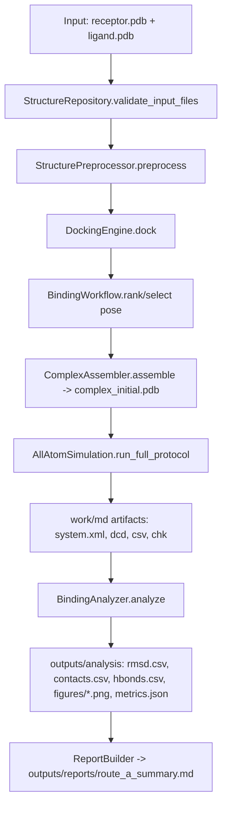

# sakura032/VEVs 仓库深度评估与下一步研发设计报告

## 执行摘要

该仓库目前已经把“可运行的分子动力学执行核心（runnable MD execution core）”落到实处：`src/models/all_atom/simulation_runner.py` 的 `AllAtomSimulation` 具备完整、可真实运行的 OpenMM 主链（`prepare_system → minimize → equilibrate(NVT/NPT) → production`），并通过 `scripts/run_minimal_openmm_validation.py` 做了工程链路级别的最小验证（engine validation），能够产出体系序列化文件、轨迹、日志与 checkpoint 等标准产物。与此同时，案例二工作流层 `src/models/workflows/binding_workflow.py` 已完成“编排层（orchestration layer）”骨架与接口契约，但其依赖的 concrete 组件（repository / preprocessor / docking / assembler / analyzer）尚未落地，因此**端到端科学工作流（end-to-end scientific workflow）仍未形成**，这与 README 的自我诊断一致。

从可发表标准（publishability standard）看：当前系统属于“工程可跑（engineering-runnable）”而非“科学可证（scientifically defensible）”。如果目标是顶刊级别的 integrin-mediated recognition / EV targeting 机制叙事，那么仅有一条可跑的 OpenMM pipeline 远不足以支撑结论：关键缺口集中在（i）输入与参数化的可追溯性（provenance & parameterization），（ii）对接/构象初值的可复现与合理性（reproducibility & plausibility），（iii）结合稳定性/自由能估计的统计一致性与不确定性评估（uncertainty quantification），（iv）输出报告与证据链的“证据—结论对齐（evidence–claim alignment）”。尤其需要警惕：若 Docking 与自由能仍是 placeholder，则任何“结合自由能”或“靶向识别机制”语言都会被审稿人直接判定为**证据不足（insufficient evidence）**。对于端点法（MM/PBSA、MM/GBSA）也应保持方法学克制：其适用边界主要是**同系列体系粗排序（rough ranking among congeneric systems）**，不应被包装为严格自由能结论。citeturn11search0turn11search8turn11search5

本报告给出：现状结构的精确梳理、缺口清单、优先级路线图（含工作量等级）、一套可直接落地的模块与文件级实现方案（含函数签名、I/O 格式、推荐依赖），以及对应的单元/集成测试与产物验证清单。

## 仓库现状与架构评估

### 分层结构与契约边界

当前代码总体符合 `casetwo.md` 强调的“硬切层（hard separation of layers）”方向：配置层、契约层、执行层、工作流层已分离，并且将 workflow 的依赖通过 `Protocol` 形式显式化，属于可扩展工程的正确姿势（sound architecture）。这一点比“把所有逻辑塞进一个大类”更接近可维护、可审查的研究原型标准。

- 配置层：`src/configs/`
  - `SystemConfig` + `ProjectPaths`：系统输入与目录约定；`validate()` 做基本校验。
  - `MDConfig`：时间步长、平衡/生产时长、平台（CPU/CUDA/OpenCL）、barostat 开关等。
  - `DockingConfig` / `EndpointFreeEnergyConfig` / `UmbrellaSamplingConfig`：把未来的 docking 与自由能参数空间先冻结（freeze config space），但目前仍为 placeholder（尤其 `method="placeholder"`）。
- 契约层：`src/interfaces/contracts.py`
  - 将“输入清单 → 结构准备 → docking pose 集 → 组装体系 → MD 产物 → 分析输出”定义为一组 dataclass，同时用 `Protocol` 规定组件接口。这使得后续替换 docking backend、替换分析器不会破坏 workflow 层代码，是**可持续演化（evolvable architecture）**的基础。
- 执行层：`src/models/all_atom/simulation_runner.py`
  - `AllAtomSimulation` 是实际的 OpenMM execution façade。
  - 当前只支持 `solution` 模式；`membrane` 模式抛 `NotImplementedError`。
- 工作流层：`src/models/workflows/binding_workflow.py`
  - `BindingWorkflow` 只做 orchestration：input validate、preprocess、dock、rank/select、assemble、run_md、(optional) analyze、summarize。
  - 其缺口并不在“编排逻辑”，而在**没有 concrete 实现**。

### OpenMM 执行链的关键实现与可改进点

`AllAtomSimulation.prepare_system()` 使用 OpenMM application layer 的典型流程：读 PDB → `ForceField` → `Modeller.addHydrogens()` → `Modeller.addSolvent()` → `ForceField.createSystem()` → `Simulation`。其中 `addSolvent()` 的 padding / water model / ionicStrength 等行为与 OpenMM 用户指南一致。citeturn9search1turn9search2

`production()` 配置 `DCDReporter`、`StateDataReporter`、`CheckpointReporter` 产出轨迹、CSV 数值日志与 checkpoint，其 API 行为与 OpenMM 文档一致。citeturn10search10turn10search6

`equilibrate()` 在需要时向 system 添加 `MonteCarloBarostat` 并 `reinitialize(preserveState=True)`，这是 OpenMM 中修改 `System` 后使 `Context` 生效的常规做法；同时 barostat 的物理含义与 OpenMM 文档描述一致。citeturn10search1

必须指出的结构性问题（会直接影响“可复现与可审稿”）：

- **产物目录固定且会覆盖**：`_build_artifact_paths()` 把所有产物写到 `work/md/` 固定文件名（`production.dcd` 等）。这对单次验证方便，但对“多体系、多重复（replicates）、多参数扫描”是灾难：会覆盖、难追溯、难并行。
- **体系构建参数仍存在硬编码**：例如 `addSolvent(padding=1.0 nm)` 未由 `SystemConfig/MDConfig` 控制；生产阶段 `enforcePeriodicBox=None` 依赖 OpenMM 自动决策。对严谨研究，应将关键数值显式化并写入 run manifest。
- **力场覆盖假设过强**：当前假设 `forcefield.createSystem()` 能覆盖全部残基/原子类型；这在 integrin-配体场景中高度取决于配体类型（短肽 vs 小分子 vs 修饰肽）。若出现非标准残基/小分子，OpenMM 默认 Amber/CHARMM XML 不会自动给参数，这会在体系构建阶段直接失败，或更糟糕：以不正确模板“默默运行”。（此处属于工程风险推断；与 OpenMM ForceField 的一般机制一致。）citeturn7search2turn9search2

### 最小验证脚本的意义与边界

`scripts/run_minimal_openmm_validation.py` 清晰地把目标限定为 engine validation，并用 PDBFixer 做了“最小预清洗（minimal cleaning）”：`removeHeterogens`, `findMissingAtoms`, `addMissingAtoms`。这与 PDBFixer Manual 的推荐用法一致。citeturn9search3

脚本还用 MDAnalysis 读取 PDB + DCD 做帧数 sanity check，符合 MDAnalysis “Universe 需要 topology + trajectory” 的基本模型。citeturn9search5turn9search6

但必须强调：该脚本并不证明任何 binding 科学结论，只证明 OpenMM 管线打通。这一点在你后续写论文时必须被严格区分，否则属于典型“证据—结论错配（evidence–claim mismatch）”。

## Route A 端到端工作流缺口与占位清单

### 现有 Route A 形成闭环所需的最小组件

`BindingWorkflow` 目前需要以下依赖注入组件：

- `StructureRepositoryProtocol`: `validate_input_files(manifest)`
- `StructurePreprocessorProtocol`: `preprocess(manifest) -> PreparedStructures`
- `DockingEngineProtocol`: `dock(prepared) -> DockingResult`
- `ComplexAssemblerProtocol`: `assemble(prepared, pose) -> AssembledComplex`
- `SimulationRunnerProtocol`: 已可用 `AllAtomSimulation` 实现
- `BindingAnalyzerProtocol`: `analyze(simulation) -> dict[str, Path]`

仓库内目前只有协议，没有 concrete：

- `StructureRepository`：缺
- `StructurePreprocessor`：缺（脚本里有测试专用 `prepare_clean_test_input()`，但不是可复用组件）
- `DockingEngine`：缺（`DockingConfig.backend="placeholder"` 暗示占位）
- `ComplexAssembler`：缺
- `BindingAnalyzer`：缺（也意味着“分析与可视化模块”整体为空）

如果你的目标是“Route A 最小可运行闭环（minimum runnable loop）”，那么优先级**必然是**先补齐这些 concrete，并做一个 Route A 的入口脚本，使 `BindingWorkflow.run()` 真正可执行。

### README 对 work/md 产物的描述与仓库可核验性

README 声称 `work/md/` 下已有完整输出（`system.xml`, `production.dcd` 等）。但从仓库内容可见，这些大概率是本地运行产物而非版本控制内容（典型做法也应如此，DCD 等不宜提交）。因此，对外同步时应把表述从“仓库包含产物”改为“在本地运行脚本可生成产物”，并在文档中给出复现实验命令与环境依赖清单，否则审稿与复现阶段会被质疑可重复性（reproducibility）。

## 下一步开发路线图与里程碑

以下计划按“先闭环、后增强（close the loop first, then enhance）”原则，并且刻意把“科学可信度提升（scientific defensibility）”作为验收标准，而不是“代码更长”。

### 里程碑规划与工作量评估

| 里程碑 | 目标（Definition of Done） | 关键交付物（repo 路径） | 预估工作量 |
|---|---|---|---|
| 架构卫生与可安装性（packaging hygiene） | 能 `pip install -e .`；脚本无需手动改 `sys.path`；记录运行配置 | `pyproject.toml`（新增）、`src/__init__.py`（已存在）、`docs/`（新增） | 低 |
| Route A 端到端贯通（E2E Route A） | `BindingWorkflow.run()` 可在 placeholder docking 下运行并产出：assembled PDB、MD artifacts、基础分析 JSON+图 | `src/utils/*`（新增）、`src/analysis/*`（新增）、`scripts/run_binding_route_a.py`（新增） | 中 |
| 输出与证据链标准化（provenance & reporting） | 每次 run 生成独立 run_id 目录；输出包含 config、版本信息、随机种子；报告可追溯 | `src/utils/run_metadata.py`（新增）、`outputs/reports/*.md`（运行产物规范） | 中 |
| Docking backend 接入（可选） | Vina/smina/gnina 至少一种可运行；输出 poses.csv + pose PDB；可重复 | `src/docking/vina_engine.py`（新增） | 中-高（取决于平台） |
| 基础 endpoint FE 接入（可选但建议） | 基于现有工具（如 AmberTools 的 MMPBSA.py）跑通并产出 summary.csv；明确适用边界 | `src/free_energy/mmpbsa_adapter.py`（新增）、`scripts/run_endpoint_fe.py`（新增） | 高 |
| Umbrella sampling 框架（后置） | window generation + restrained MD + WHAM/MBAR 重建 PMF；具备误差估计 | `src/free_energy/umbrella_workflow.py`（新增）、`src/free_energy/pmf.py`（新增） | 高 |

关于端点自由能与 umbrella sampling：端点法在 drug-design ranking 场景常用，但其理论局限与易误用已被多篇综述/观点文章反复强调，应在报告与论文中明确其证据等级，避免 overstated claims。citeturn11search0turn11search8turn11search5  
对于 umbrella sampling 的统计重建，你至少需要引用/实现 WHAM（Kumar 等 1992）或 MBAR（Shirts & Chodera 2008），并给出窗口 overlap 与误差评估，否则 PMF 曲线难以审稿通过。citeturn13search0turn12search1

### Route A 验收测试应如何定义

Route A 的验收不应是“代码跑完”，而应包含最小科学合理性指标（minimum scientific sanity metrics），例如：

- 轨迹可读且帧数、时间步与日志一致（MDAnalysis sanity check）。citeturn9search5turn9search6  
- RMSD（ligand 或 interface）在合理范围内，不出现明显爆炸（并不等同于“结合稳定”，但能排除显性错误）。
- `md_log.csv` 中温度收敛到设定值附近（热浴有效）；NPT 阶段体积/密度不呈现发散趋势（barostat 基本正常）。`StateDataReporter` 支持输出这些字段。citeturn10search6

## 代码结构与实现设计

### 建议新增的文档框架目录

建议在仓库新增一套“新框架目录（new framework docs）”，把 `casetwo.md` 中的架构思想转为更贴近实现的工程文档（并避免把设计散落在对话里）：

- `docs/architecture/overview.md`：分层边界、目录约定、核心抽象
- `docs/architecture/io_contracts.md`：I/O contract，字段、格式、示例
- `docs/architecture/route_a_workflow.md`：Route A 端到端时序、产物规范
- `docs/architecture/testing_validation.md`：测试分层、慢测试策略、产物验收清单

### 模块关系与 Route A 工作流图

下面的图应写入 `docs/architecture/route_a_workflow.md`（Mermaid 渲染）。



### 新增/修改文件的精确清单与接口设计

以下设计遵循你当前 `contracts.py` 的数据结构，避免返工。

#### 结构准备与数据管理层

**新增：`src/utils/structure_repository.py`**

- 目标：实现 `StructureRepositoryProtocol`，并把“输入合法性 + 可复现 manifest 输出”固化。
- 核心类与签名（建议）：
  - `class StructureRepository(StructureRepositoryProtocol):`
    - `def __init__(self, paths: ProjectPaths): ...`
    - `def validate_input_files(self, manifest: InputManifest) -> None:`
    - `def export_manifest(self, manifest: InputManifest, out_path: Path) -> Path:`
- 输入：`InputManifest`
- 输出：`manifest.json`（建议写到 `outputs/metadata/run_manifest.json`）
- 关键校验点：
  - 文件存在性、扩展名白名单（`.pdb`, `.cif`, ligand 如果允许 `.sdf/.mol2` 必须显式声明）
  - receptor/ligand 是否被误传同一个文件（当前验证脚本这样做，但真实 workflow 应禁止，除非明示 `allow_placeholder=True`）
  - 记录哈希（sha256）、文件大小、修改时间：这是审稿阶段回答“你到底跑的是什么输入”的底线。

**新增：`src/utils/structure_preprocessor.py`**

- 目标：实现 `StructurePreprocessorProtocol`；把脚本里的 PDBFixer 清洗提升为可复用组件。
- 推荐依赖：`pdbfixer` + OpenMM app 的写出（与现有脚本一致）。citeturn9search3
- 核心类与签名：
  - `class StructurePreprocessor(StructurePreprocessorProtocol):`
    - `def __init__(self, paths: ProjectPaths, ph: float): ...`
    - `def preprocess(self, manifest: InputManifest) -> PreparedStructures:`
    - `def _clean_pdb(self, in_pdb: Path, out_pdb: Path) -> Path:`
- 输出：
  - `work/prep/receptor_clean.pdb`
  - `work/prep/ligand_clean.pdb`（若 ligand 是 PDB）
  - `outputs/metadata/preprocess_report.json`（记录缺失残基/缺失原子/删除 heterogen 等）

#### Docking 与体系组装层

**新增：`src/docking/placeholder.py`（优先用于闭环测试）**

- 目标：可复现占位（deterministic placeholder）而不是随机数；用于 E2E 测试。
- 核心类：
  - `class PlaceholderDockingEngine(DockingEngineProtocol):`
    - `def __init__(self, docking_config: DockingConfig, paths: ProjectPaths): ...`
    - `def dock(self, prepared: PreparedStructures) -> DockingResult:`
- 行为建议：
  - 直接把 ligand_clean 作为唯一 pose（`pose_id=0`，`score=0.0`），并写 `outputs/docking/poses.csv`
  - 这样可以让 workflow 端到端跑通，同时避免“随机评分”导致测试不稳定。

**可选新增：`src/docking/vina_engine.py`（中后期）**

- 目标：接入真实 docking backend（Vina/smina/gnina）。
- 注意：对短肽/蛋白-蛋白对接，Vina 类 backend 并不适用；如果你的 ligand 实为肽（RGD 等），应考虑专用方法，否则会被审稿质疑“方法不匹配问题定义（method–question misalignment）”。（此处为审稿风险判断。）
- 接口同 `DockingEngineProtocol`，但依赖外部二进制；应把调用封装为 adapter，并强制写出：
  - `poses.csv`（score、rank、seed、box）
  - `pose_*.pdb`（或 pdbqt→pdb 转换日志）

**新增：`src/utils/complex_assembler.py`**

- 目标：实现 `ComplexAssemblerProtocol`，在 solution mode 下把 receptor + ligand pose 合并为 `complex_initial.pdb`。
- 推荐最稳妥思路：**写一个最小 PDB merger**（不引入过多依赖），核心是：
  - 重新编号 atom serial
  - 分配不同 chainID（如 receptor=A，ligand=B）
  - 保留/修正 `TER` 与 `END`
- 接口：
  - `class ComplexAssembler(ComplexAssemblerProtocol):`
    - `def __init__(self, paths: ProjectPaths): ...`
    - `def assemble(self, prepared: PreparedStructures, pose: DockingPose) -> AssembledComplex:`
- 输出建议：
  - `work/assembled/complex_initial.pdb`
  - `AssembledComplex(mode="solution")`

#### 分析与可视化层

**新增：`src/analysis/binding_analyzer.py`**

- 目标：实现 `BindingAnalyzerProtocol`，给出最小但可审查的 binding stability 指标与图形。
- 推荐依赖：entity["organization","MDAnalysis","md trajectory analysis software"] + `numpy` + `pandas` + `matplotlib`
  - Universe/trajectory 读取：citeturn9search5turn9search6
  - RMSD 分析类：citeturn14search1
- 接口：
  - `class BindingAnalyzer(BindingAnalyzerProtocol):`
    - `def __init__(self, paths: ProjectPaths, selections: dict[str, str]): ...`
    - `def analyze(self, simulation: SimulationArtifacts) -> dict[str, Path]:`
    - `def compute_rmsd(self, u) -> Path:`
    - `def compute_contacts(self, u, cutoff_angstrom: float = 4.0) -> Path:`
    - `def compute_hbonds(self, u) -> Path:`（可先占位，后续替换为 MDAnalysis 的 H-bond 工具）
    - `def build_figures(self, rmsd_csv: Path, contacts_csv: Path) -> list[Path]:`
- 输出目录建议：
  - `outputs/analysis/binding/rmsd.csv`
  - `outputs/analysis/binding/contacts.csv`
  - `outputs/analysis/binding/metrics.json`
  - `outputs/analysis/binding/figures/rmsd.png` 等

**新增：`src/analysis/report_builder.py`** 

- 目标：把“产物 + 指标 + 配置”汇总为可读的 Markdown 报告（reviewer-friendly report）。
- 接口：
  - `class ReportBuilder:`
    - `def build_route_a_report(self, result: BindingWorkflowResult) -> Path:`
- 输出：
  - `outputs/reports/route_a_summary.md`

#### 工作流集成入口

**新增：`scripts/run_binding_route_a.py`**

- 目标：作为 Route A 正式入口，替代“只有 engine validation”。
- 行为：构建 configs/context → 实例化 concrete components → `BindingWorkflow.run()` → 写报告。

### 关键代码片段示例

以下片段是“可直接粘贴”的骨架，强调可复现与 I/O 清晰。请注意把文件放到指定路径。

#### `src/docking/placeholder.py`

```python
# src/docking/placeholder.py
from __future__ import annotations

from dataclasses import dataclass
from pathlib import Path
import csv

from src.configs import DockingConfig, ProjectPaths
from src.interfaces.contracts import DockingEngineProtocol, DockingPose, DockingResult, PreparedStructures


class PlaceholderDockingEngine(DockingEngineProtocol):
    """
    Deterministic placeholder docking engine.

    This is for pipeline integration and testing only.
    It MUST NOT be used for scientific claims.
    """

    def __init__(self, docking_config: DockingConfig, paths: ProjectPaths):
        self.cfg = docking_config
        self.paths = paths
        self.paths.ensure_dirs()

    def dock(self, prepared: PreparedStructures) -> DockingResult:
        out_dir = self.paths.output_dir / "docking"
        out_dir.mkdir(parents=True, exist_ok=True)

        poses_csv = out_dir / "poses.csv"

        # Deterministic single pose: use the prepared ligand as-is.
        pose = DockingPose(
            pose_id=0,
            score=0.0,
            rmsd=None,
            pose_file=prepared.ligand_prepared,
            metadata={"backend": "placeholder"},
        )

        with poses_csv.open("w", newline="", encoding="utf-8") as f:
            w = csv.DictWriter(f, fieldnames=["pose_id", "score", "rmsd", "pose_file", "backend"])
            w.writeheader()
            w.writerow(
                {
                    "pose_id": pose.pose_id,
                    "score": pose.score,
                    "rmsd": pose.rmsd,
                    "pose_file": str(pose.pose_file) if pose.pose_file else "",
                    "backend": "placeholder",
                }
            )

        return DockingResult(poses=[pose], ranked_pose_table=poses_csv, selected_pose=None)
```

#### `src/utils/structure_preprocessor.py`（将脚本逻辑组件化）

```python
# src/utils/structure_preprocessor.py
from __future__ import annotations

from dataclasses import asdict
from pathlib import Path
import json

from openmm import app
from pdbfixer import PDBFixer

from src.configs import ProjectPaths
from src.interfaces.contracts import InputManifest, PreparedStructures, StructurePreprocessorProtocol


class StructurePreprocessor(StructurePreprocessorProtocol):
    """
    Minimal structure preprocessor based on PDBFixer.

    Scope:
    - receptor/ligand are assumed to be PDB (e.g., protein/peptide).
    - small-molecule parameterization is out of scope for this minimal version.
    """

    def __init__(self, paths: ProjectPaths, ph: float = 7.4):
        self.paths = paths
        self.ph = ph
        self.paths.ensure_dirs()

    def preprocess(self, manifest: InputManifest) -> PreparedStructures:
        prep_dir = self.paths.work_dir / "prep"
        prep_dir.mkdir(parents=True, exist_ok=True)

        receptor_clean = prep_dir / "receptor_clean.pdb"
        ligand_clean = prep_dir / "ligand_clean.pdb"

        self._clean_pdb(manifest.receptor_path, receptor_clean)
        self._clean_pdb(manifest.ligand_path, ligand_clean)

        report = {
            "receptor_in": str(manifest.receptor_path),
            "ligand_in": str(manifest.ligand_path),
            "receptor_clean": str(receptor_clean),
            "ligand_clean": str(ligand_clean),
            "ph": self.ph,
        }
        report_path = self.paths.output_dir / "metadata" / "preprocess_report.json"
        report_path.parent.mkdir(parents=True, exist_ok=True)
        report_path.write_text(json.dumps(report, indent=2, ensure_ascii=False), encoding="utf-8")

        return PreparedStructures(
            receptor_clean=receptor_clean,
            ligand_prepared=ligand_clean,
            preprocess_report=report_path,
        )

    def _clean_pdb(self, in_pdb: Path, out_pdb: Path) -> Path:
        fixer = PDBFixer(filename=str(in_pdb))
        fixer.removeHeterogens(keepWater=False)
        fixer.findMissingResidues()
        fixer.findMissingAtoms()
        fixer.addMissingAtoms()

        out_pdb.parent.mkdir(parents=True, exist_ok=True)
        with out_pdb.open("w", encoding="utf-8") as handle:
            app.PDBFile.writeFile(fixer.topology, fixer.positions, handle)

        return out_pdb
```

#### `src/analysis/binding_analyzer.py`（RMSD 最小实现示例）

```python
# src/analysis/binding_analyzer.py
from __future__ import annotations

from pathlib import Path
import json

import numpy as np
import pandas as pd

import MDAnalysis as mda
from MDAnalysis.analysis.rms import RMSD

import matplotlib.pyplot as plt

from src.configs import ProjectPaths
from src.interfaces.contracts import BindingAnalyzerProtocol, SimulationArtifacts


class BindingAnalyzer(BindingAnalyzerProtocol):
    """
    Minimal binding trajectory analyzer.

    Outputs are intended to be reviewer-auditable:
    - raw time series (CSV)
    - summary metrics (JSON)
    - figures (PNG)
    """

    def __init__(self, paths: ProjectPaths, selections: dict[str, str] | None = None):
        self.paths = paths
        self.paths.ensure_dirs()
        self.selections = selections or {
            "align": "protein and backbone",
            "ligand": "not protein",  # placeholder: adjust to your system
        }

    def analyze(self, simulation: SimulationArtifacts) -> dict[str, Path]:
        if simulation.npt_last_structure is None or simulation.trajectory is None:
            raise ValueError("Missing topology/trajectory artifacts for analysis.")

        out_dir = self.paths.output_dir / "analysis" / "binding"
        fig_dir = out_dir / "figures"
        fig_dir.mkdir(parents=True, exist_ok=True)

        u = mda.Universe(str(simulation.npt_last_structure), str(simulation.trajectory))

        rmsd_csv = out_dir / "rmsd.csv"
        metrics_json = out_dir / "metrics.json"
        rmsd_png = fig_dir / "rmsd.png"

        # RMSD of ligand selection relative to frame 0 after aligning on protein backbone.
        # NOTE: selection strings must be tailored; the defaults are intentionally conservative placeholders.
        R = RMSD(
            u,
            u,
            select=self.selections["align"],
            groupselections=[self.selections["ligand"]],
            ref_frame=0,
        ).run()

        # R.rmsd columns: frame, time(ps), RMSD(Å) for the main selection,
        # then additional columns for groupselections.
        arr = R.rmsd
        df = pd.DataFrame(arr, columns=["frame", "time_ps", "rmsd_align", "rmsd_ligand"])
        df.to_csv(rmsd_csv, index=False)

        # Simple figure
        plt.figure()
        plt.plot(df["time_ps"] / 1000.0, df["rmsd_ligand"])
        plt.xlabel("Time (ns)")
        plt.ylabel("Ligand RMSD (Å)")
        plt.tight_layout()
        plt.savefig(rmsd_png, dpi=200)
        plt.close()

        summary = {
            "n_frames": int(len(u.trajectory)),
            "rmsd_ligand_mean_A": float(df["rmsd_ligand"].mean()),
            "rmsd_ligand_median_A": float(df["rmsd_ligand"].median()),
            "rmsd_ligand_p95_A": float(df["rmsd_ligand"].quantile(0.95)),
        }
        metrics_json.write_text(json.dumps(summary, indent=2), encoding="utf-8")

        return {
            "rmsd_csv": rmsd_csv,
            "rmsd_png": rmsd_png,
            "metrics_json": metrics_json,
        }
```

## 测试策略、产物验收清单与风险假设

### 单元测试与集成测试的分层建议

建议引入 entity["organization","pytest","python testing framework"]，并明确“快测试（unit）”与“慢测试（integration/MD）”分离。pytest fixtures 的组织方式可参考官方文档。citeturn8search0turn8search2

**新增目录：`tests/`（以及 `tests/conftest.py`）**

- 单元测试（默认跑，秒级）：
  - `tests/test_configs.py`
    - 覆盖 `SystemConfig.validate()`、`MDConfig.validate()`、`MembraneConfig.validate()` 的边界条件（负温度、负离子强度、空 lipid composition 等）。
  - `tests/test_simulation_runner_math.py`
    - 仅测试 `_steps_from_ns()` 的换算正确性与异常。
  - `tests/test_contracts_smoke.py`
    - 验证 dataclass 字段存在，protocol runtime_checkable 下 `isinstance(obj, Protocol)` 行为符合预期（可选）。
- 集成测试（默认跳过，或用 `-m slow` 显式开启）：
  - `tests/test_openmm_minimal_validation.py`
    - 以极短 `MDConfig`（如 production_ns=0.001）运行一次，检查关键 artifacts 存在且非空。
    - 若环境缺少 OpenMM/PDBFixer/MDAnalysis，则 skip。

### 推荐测试命令

- 单元测试（默认）：
  - `python -m pytest -q`
- 含慢测试：
  - `python -m pytest -q -m slow`

（你需要在 `pyproject.toml` 或 `pytest.ini` 中注册 marker `slow`，并把 OpenMM 集成测试标记为 slow。）

### work/md 产物验收清单（Validation Checklist）

对每一次运行（建议以 run_id 子目录隔离后），验收应包含：

1. **文件存在性与非空**
   - `system.xml`、`state_init.xml`、`minimized.pdb`、`equil_nvt_last.pdb`、`equil_npt_last.pdb`、`production.dcd`、`md_log.csv`、`production.chk`、`final_state.xml`
2. **OpenMM 产物一致性**
   - `md_log.csv` 的 step 数应与 `production_ns / timestep_fs` 对应的步数一致（允许因取整产生 1 step 误差）。
   - 温度字段存在且数值非 NaN（`StateDataReporter` 输出字段由其构造参数控制）。citeturn10search6
3. **轨迹可读性**
   - `MDAnalysis.Universe(topology, dcd)` 可读，帧数 > 0。citeturn9search5turn9search6
4. **最小科学 sanity**
   - 最小化后能量下降（可从 state 或日志判断）
   - RMSD 计算不报错；若 RMSD 极端发散，应判定 run 失败并提示初值/参数化问题（而不是“继续跑更久”）

### 风险、未指定项与必要假设

#### 未指定但会影响实现与复现的关键环境项（必须显式化）

- Python 版本（未指定）
- OpenMM 版本（未指定；影响 `ForceField` 文件名、某些 API 是否存在）citeturn9search1turn10search10
- GPU 环境（CUDA/OpenCL 版本与驱动；未指定）
- 操作系统（Linux/macOS/Windows；未指定）
- 是否使用 conda/mamba；是否允许容器化（Docker/Singularity；未指定）
- Docking backend（二进制是否可用、平台兼容性；未指定）

#### 结构性科学风险（审稿必打点）

- **配体参数化（ligand parameterization）缺失**：如果 ligand 不是标准蛋白/肽残基，当前 Amber/CHARMM XML 无法自动覆盖，体系构建会失败或不可信。这是“结构性、不可修补（structural, not cosmetic）”风险。
- **Docking 方法与问题类型可能不匹配**：integrin-肽/蛋白识别若被简化为小分子 docking，会被质疑方法选择的科学合理性（methodological appropriateness）。
- **端点自由能与机制叙事不匹配的风险**：MM/PBSA、MM/GBSA 作为端点近似法，适合粗排序但不能替代严格自由能；若用其直接支撑“机制”或“绝对亲和力”，属于高风险表述。citeturn11search0turn11search8turn11search5
- **抽样与不确定性评估缺失**：单条轨迹、无重复、无收敛评估，通常无法通过高标准审稿。若要走 umbrella sampling，需 WHAM/MBAR 并给出 overlap/误差。citeturn13search0turn12search1turn12search10

#### 关于案例二科学背景的定位（为何值得做，但必须避免过度叙事）

肿瘤外泌体/细胞外囊泡表面整合素与器官趋向性转移存在强文献基础，例如 2015 年 entity["organization","Nature","science journal"] 的工作指出外泌体整合素组合与器官趋向性相关，并可通过阻断整合素降低摄取与转移倾向。citeturn15search0turn15search1 但这类生物学结论与“你在模拟里计算的 binding free energy”之间存在巨大证据鸿沟：你必须明确模拟对象（哪一个 integrin、哪一个配体/肽、哪一种膜环境/糖基化状态）、并用系统性验证把计算指标与实验/表型对齐，否则很容易落入“问题伪装（problem masquerading）”：技术上可跑，但科学增量不足或因果链条断裂。

