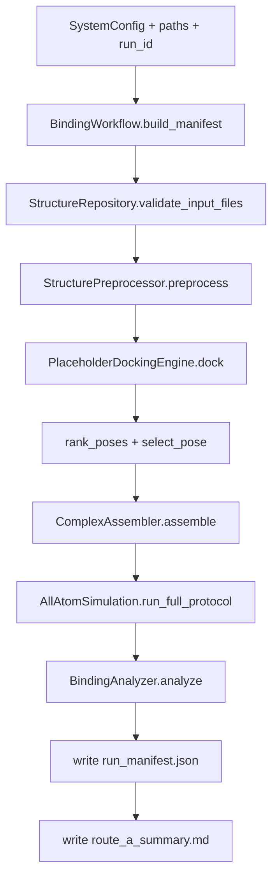

# Route A Workflow Spec (solution mode)

更新时间：2026-03-13

本文档描述当前仓库中 Route A 的真实可运行流程、artifact 规范与边界声明。

## 1. Scope

- 目标：打通 `validate -> preprocess -> dock -> assemble -> AA-MD -> analyze -> summarize`
- 模式：`solution`（CPU-first）
- 非目标：Route B（membrane）、真实 endpoint FE、umbrella/PMF（当前阶段未实现）

## 2. Runtime Sequence



## 3. Entrypoints

### 3.1 Route A main
```bash
python scripts/run_binding_route_a.py \
  --run-id routeA_YYYYmmdd_HHMMSS \
  --receptor data/test_systems/minimal_complex/minimal_complex.pdb \
  --ligand data/test_systems/minimal_complex/minimal_complex.pdb
```

### 3.2 OpenMM chain validation only
```bash
python scripts/run_minimal_openmm_validation.py \
  --run-id openmm_validation_YYYYmmdd_HHMMSS
```

## 4. Artifact Spec

### 4.1 `work/runs/<run_id>/` (process artifacts)

- `preprocessed/receptor_clean.pdb`
- `preprocessed/ligand_prepared.pdb`
- `assembled/complex_initial.pdb`
- `md/complex_fixed.pdb`（execution-layer PDBFixer post-fix，开启时生成）
- `md/solvated.pdb`（solvated initial anchor）
- `md/system.xml`
- `md/state_init.xml`
- `md/minimized.pdb`
- `md/equil_nvt_last.pdb`
- `md/equil_npt_last.pdb`
- `md/production.dcd`
- `md/md_log.csv`
- `md/production.chk`
- `md/final_state.xml`

### 4.2 `outputs/runs/<run_id>/` (result artifacts)

- `docking/poses.csv`
- `docking/poses/pose_*.pdb`
- `analysis/binding/metrics.json`
- `analysis/binding/rmsd.csv`
- `analysis/binding/figures/*.png`
- `metadata/preprocess_report.json`
- `metadata/md_pdbfixer_report.json`
- `metadata/run_manifest.json`
- `reports/route_a_summary.md`

## 5. MD Execution Notes (AllAtomSimulation)

1. 力场文件映射（OpenMM XML mapping）
- `amber14sb`: `amber14-all.xml` + `amber14/<water>.xml`
- `charmm36`: `charmm36.xml` + `charmm36/<water>.xml`

2. 平台属性兼容（platform-specific properties）
- 运行时查询 `Platform.getPropertyNames()`
- 精度属性自动兼容 `Precision` / `CudaPrecision` / `OpenCLPrecision`
- 可选支持 `device_index`、`cpu_threads`
- 请求平台不可用时自动 fallback 到 CPU

3. execution-layer PDBFixer post-fix
- `MDConfig.enable_pdbfixer_fix=True` 时启用
- `SystemConfig.replace_nonstandard_residues=False` 默认禁用替换，避免 silent mutation

## 6. Boundary Statements

1. placeholder docking 结果不能作为 scientific conclusion。  
2. Route A 结果是工程闭环验证（engine/workflow validation），不是发表级结论。  
3. analysis 的 fallback 结果属于诊断信息，不等价于真实轨迹物理指标。  
