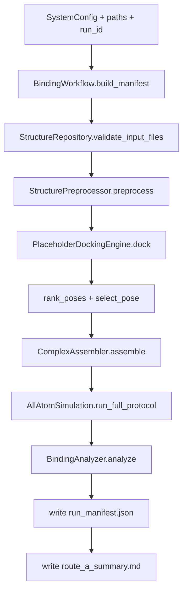

# Route A Workflow

更新时间：2026-03-11

本文件描述当前仓库 Route A（solution mode）端到端时序、产物规范与边界声明。

## 1. 范围与目标

- 范围：integrin-mediated targeting recognition 的 Route A 最小闭环。
- 目标：打通“输入 -> 预处理 -> docking -> 组装 -> AA-MD -> 分析 -> 报告”。
- 非目标：Route B 膜体系、真实 endpoint FE、umbrella/PMF（当前未实现）。

## 2. E2E 时序（当前实现）



## 3. 脚本入口

- 主入口：`scripts/run_binding_route_a.py`
- 推荐命令：

```bash
python scripts/run_binding_route_a.py \
  --run-id routeA_YYYYmmdd_HHMMSS \
  --receptor data/test_systems/minimal_complex/minimal_complex.pdb \
  --ligand data/test_systems/minimal_complex/minimal_complex.pdb
```

## 4. 产物规范（Artifact Spec）

### 4.1 `work/runs/<run_id>/`（过程产物）

- `preprocessed/receptor_clean.pdb`
- `preprocessed/ligand_prepared.pdb`
- `assembled/complex_initial.pdb`
- `md/system.xml`
- `md/state_init.xml`
- `md/minimized.pdb`
- `md/equil_nvt_last.pdb`
- `md/equil_npt_last.pdb`
- `md/production.dcd`
- `md/md_log.csv`
- `md/production.chk`
- `md/final_state.xml`

### 4.2 `outputs/runs/<run_id>/`（结果产物）

- `docking/poses.csv`
- `docking/poses/pose_*.pdb`
- `analysis/binding/metrics.json`
- `analysis/binding/rmsd.csv`（trajectory 模式）
- `analysis/binding/figures/*.png`
- `metadata/preprocess_report.json`
- `metadata/run_manifest.json`
- `reports/route_a_summary.md`

## 5. 边界声明（必须写入结果）

1. placeholder docking 边界
- `scientific_validity=placeholder_not_physical`
- `score_semantics=proxy_lower_is_better`
- `proxy_*` 字段仅作工程验证与相对排序

2. fallback analysis 边界
- `metrics_semantics=diagnostic_not_physical`
- `diagnostic="true"`

3. summary 边界
- `route_a_summary.md` 必须写明 placeholder 时“不能作为发表级物理证据”

## 6. 失败点与排查顺序

1. 输入文件问题
- 由 `StructureRepository.validate_input_files` 抛错（路径/格式）

2. 结构预处理依赖问题
- `pdbfixer` / `openmm` 缺失导致 `StructurePreprocessor` 抛错

3. OpenMM 执行问题
- 力场不匹配、原子类型不支持、平台不可用

4. 分析依赖问题
- `MDAnalysis` / `pandas` / `matplotlib` 缺失时可能进入 fallback 或失败

## 7. 与后续 Phase 的接口关系

- Route A 继续作为主干闭环，不引入破坏性重构。
- Phase 2 开始扩展 membrane-ready（`has_membrane`、protocol 分支、analysis router）。
- endpoint FE 与 umbrella 仅在接口层保留，不在本文件声明为“已实现”。

